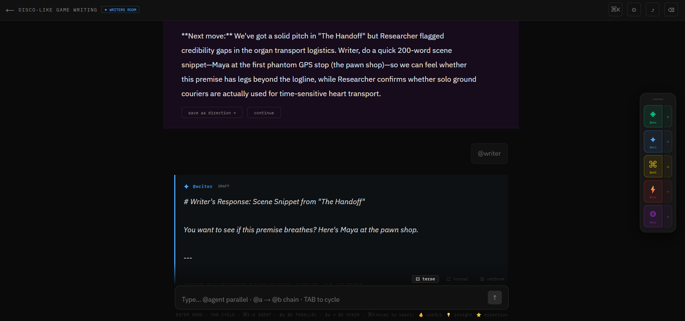

# Writers Room

A collaborative AI workspace where multiple specialized agents help you write, research, edit, and think — together.

<!-- SCREENSHOT: Drop a 1400px wide screenshot of the chat interface here showing at least two agent responses and the director card. Filename: screenshot.png -->
<!--  -->


**Live:** [writersroom.fredericlabadie.com](https://writersroom.fredericlabadie.com)

---

## What it is

Writers Room gives you a cast of AI agents with distinct roles and voices. You call them by name in your message — `@researcher`, `@writer`, `@editor` — and they respond in character. Call multiple agents in a single message and they react to each other. The `@director` synthesizes everything and tells the room what to do next.

Four room types, each with five purpose-built agents:

| Room | Agents | Use it for |
|---|---|---|
| **Writers Room** | researcher · writer · editor · critic · director | Essays, articles, scripts, brainstorming |
| **Job Hunt** | researcher · strategist · writer · coach · networker | Interview prep, applications, outreach |
| **Career** | navigator · advocate · planner · writer · scheduler | Advancement, visibility, promotion planning |
| **Publishing** | scout · editor · pitcher · marketer · advocate | Queries, submissions, launch strategy |

---

## Multi-agent syntax

```
@researcher @writer          → parallel: both respond to your message independently
@researcher → @writer        → chain: writer sees researcher's response and reacts to it
@researcher → @writer → @editor  → three-agent chain, each handing off to the next
```

When the `@director` synthesizes, their **Next move** suggestion becomes a clickable chain button — one click fires the recommended agents in sequence.

---

<!-- SCREENSHOT: Drop a screenshot of the Configure Roles screen showing voice picker and composed prompt preview. Filename: screenshot-roles.png -->
<!--  -->

## Key features

**Configure Roles** — give each agent context about your project, set their voice (persona, genre, career perspective), add up to 13 inspirations. Changes reflect live in the composed prompt preview. Export any agent's full system prompt as `.txt`, or all five as a single `.md` file.

**Directions** — star or manually save director syntheses to a pinned panel. Up to 5 directions stay visible above the chat and get injected into every agent call. The room builds toward something.

**Chain + parallel calls** — type `@a → @b` or use the `→` button in the floating dock next to each agent chip. Agents in a chain receive role-specific handoff prompts — the editor knows it's editing a writer's draft, not starting from scratch.

**@scheduler** — in Job Hunt and Career rooms, the scheduler surfaces time-sensitive tasks and suggests calendar events. Google users get direct calendar creation. GitHub users get a `.ics` download that opens in any calendar app.

**Session export** — download the full conversation as `.md` from the header `⤴` button or `⌘K`. Includes all agent responses, directions, and artifacts.

**Realtime sync** — multiple users in the same room see each other's messages live via Supabase Realtime.

**Response length** — `⊟ terse` / `⊡ normal` / `⊞ verbose` toggle above the input controls each agent's `max_tokens` multiplier (0.4× / 1.0× / 1.8×).

---

## Stack

- **Next.js 14** (App Router) + TypeScript
- **Anthropic claude-sonnet-4-5** — all agent calls
- **NextAuth v5** — Google + GitHub OAuth, Google Calendar scope
- **Supabase** — Postgres, Row Level Security, Realtime subscriptions, vector storage for RAG
- **Vercel** — deployment

---

## Architecture notes

All agent calls go through `/api/chat`. Each call receives the room's message history, the user's message, pinned directions as a context block, the agent's composed system prompt (base + voice + inspirations + user context), and an optional `chainContext` (the previous agent's full response in chain mode). The server applies a role-specific handoff prompt when `previousPersona` is present.

Rate limiting: 30 agent API calls per user per hour, enforced server-side via a `rate_limits` Supabase table.

Agent system prompts live in `lib/personas.ts` and are editable directly in the GitHub web editor — no local setup needed. Commits deploy to Vercel in ~2 minutes.

---

## Local development

```bash
git clone https://github.com/fredericlabadie/Writers-room
cd Writers-room
npm install
cp .env.example .env.local
# Fill in env vars (see below)
npm run dev
```

**Required env vars:**

```env
ANTHROPIC_API_KEY=
NEXT_PUBLIC_SUPABASE_URL=
NEXT_PUBLIC_SUPABASE_ANON_KEY=
SUPABASE_SERVICE_ROLE_KEY=
AUTH_SECRET=
NEXTAUTH_URL=http://localhost:3000
AUTH_GOOGLE_ID=
AUTH_GOOGLE_SECRET=
AUTH_GITHUB_ID=
AUTH_GITHUB_SECRET=
```

**Optional:**
```env
SPOTIFY_CLIENT_ID=
SPOTIFY_CLIENT_SECRET=
```

---

## Editing agent prompts

All 16 agent system prompts are in [`lib/personas.ts`](./lib/personas.ts). To edit:

1. Open the file in the GitHub web editor
2. Find the agent by name (e.g. `pitcher:`)
3. Edit the `system:` string
4. Commit — Vercel deploys automatically in ~2 minutes

Git history gives you version control on every prompt change.
