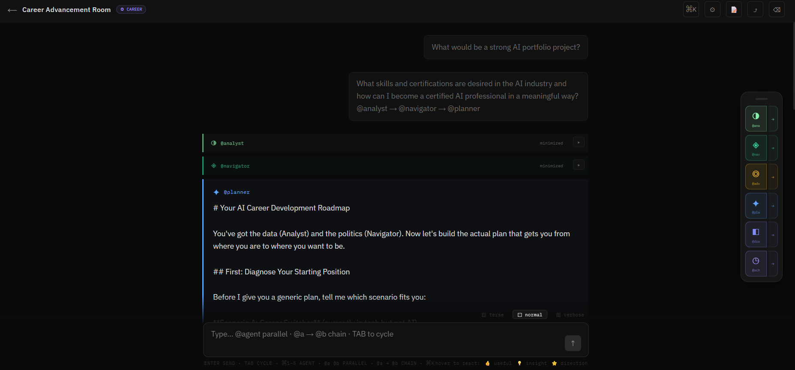

# Writers Room

A collaborative AI workspace where multiple specialized agents help you write, research, edit, and think — together.



**Live:** [writersroom.fredericlabadie.com](https://writersroom.fredericlabadie.com)

---

## What it is

Writers Room gives you a cast of AI agents with distinct roles and voices. You call them by name — `@researcher`, `@writer`, `@editor` — and they respond in character, with full awareness of everything said in the room. Call multiple agents in one message and they react to each other. The `@director` synthesizes the room and tells it what to do next.

Four room types, each with five purpose-built agents:

| Room | Agents | Use it for |
|---|---|---|
| **Writers Room** | researcher · writer · editor · critic · director | Essays, articles, scripts, brainstorming |
| **Job Hunt** | intel · strategist · writer · coach · networker | Interview prep, applications, outreach |
| **Career** | analyst · navigator · advocate · planner · drafter · scheduler | Advancement, visibility, promotion planning |
| **Publishing** | reader · scout · editor · pitcher · marketer · advocate | Queries, submissions, launch strategy |

---

## Multi-agent syntax

```
@researcher @writer               → parallel: both respond independently
@researcher → @writer             → chain: writer sees researcher's response and reacts
@researcher → @writer → @editor   → three-agent chain, each handing off to the next
```

When `@director` synthesizes, the **Next move** line becomes a clickable chain button — one tap fires the recommended agents in sequence.

---

## Features

**Voice-distinct typography** — each agent's messages render with their own typographic treatment. The Writer's prose is serif italic with generous leading. The Researcher's notes are monospace with a source footer. The Editor's revisions use a track-changes left border. The Critic's objections are indented with a dashed border. The Director's syntheses use a display serif at 20px. You can identify who's speaking from the shape of the message alone.

**Multi-agent orchestration** — parallel calls, sequential chains, and director-driven chains. Each agent in a chain receives a role-specific handoff prompt (the editor knows it's editing a draft, not starting from scratch). The full room history is injected into every call so agents never lose context.

**Vector RAG** — upload reference files (`.txt`, `.md`, `.json`, `.csv`) to a room. Chunks are embedded and retrieved at call time; the most relevant passages are injected into each agent's context automatically.

**Configure Roles** — give each agent project context, set a voice (persona, genre, career perspective), and add up to 13 inspirations. Changes reflect live in a composed prompt preview. Export any agent's system prompt as `.txt` or all five as a single `.md`.

**Directions** — star or pin director syntheses to a panel above the chat. Up to 5 directions stay visible and are injected into every subsequent agent call. The room builds toward something.

**Room Notes** — a collapsible shared notepad per room. Auto-saves every 2 seconds. Visible to all members. Persists across sessions.

**Dual export** — Google users get a Google Doc created directly in their Drive (`⤴`). GitHub users get a `.md` download. Both include the full conversation, notes, and room info.

**Realtime sync** — multiple users in the same room see each other's messages live via Supabase Realtime.

**@scheduler** — in Job Hunt and Career rooms, the scheduler surfaces time-sensitive tasks and suggests calendar events. Google users get one-click Google Calendar creation. GitHub users get a `.ics` download.

**Review links** — generate a read-only 72-hour link to any session. No login required. Useful for sharing work-in-progress with collaborators or clients.

**Spotify tone** — paste a Spotify track URL to extract its audio features (energy, valence, tempo) and map them to a mood profile. Injected into every agent call while active.

**NotebookLM bridge** — link a NotebookLM notebook to a room and export the session as a Lore Pack `.md` to import as a source.

**Response length** — `⊟ terse` / `⊡ normal` / `⊞ verbose` toggle controls each agent's `max_tokens` multiplier (0.4× / 1.0× / 1.8×).

**Message controls** — hover any message to minimize it to a compact header (▾/▸), copy it, or delete it with an inline confirmation. Collapse long agent responses to keep the room readable.

**Rate limiting** — 30 agent API calls per user per hour, enforced server-side.

---

## Stack

| Layer | Technology |
|---|---|
| Framework | Next.js 14 (App Router) + TypeScript |
| AI | Anthropic `claude-sonnet-4-5` |
| Auth | NextAuth v5 — Google OAuth + GitHub OAuth |
| Database | Supabase (Postgres + Realtime + pgvector) |
| Deployment | Vercel |
| Calendar | Google Calendar API |
| Music | Spotify Web API |

---

## Architecture

```
Browser
  └── /api/chat          POST per agent call
        ├── lib/personas  composed system prompt (base + voice + context)
        ├── lib/artifacts RAG retrieval (pgvector cosine similarity)
        ├── lib/spotify   audio feature → mood profile injection
        └── Anthropic API claude-sonnet-4-5

Supabase
  ├── rooms              id, name, room_type, notes, active_tone, notebooklm_url
  ├── messages           role, persona, content, citations
  ├── room_members       role (owner | member)
  ├── artifacts          file metadata + parsed chunks
  ├── artifact_chunks    text + pgvector embedding
  ├── review_links       token, expires_at
  └── rate_limits        user_id, call_count, window_start
```

**Agent call flow:** user message → parse `@mentions` → for each agent, build composed prompt → inject directions block + RAG chunks + chain context (if chained) → call Anthropic API → stream response to client → persist to Supabase → broadcast via Realtime.

**Chain vs parallel:** parallel calls share the same base history. Chained calls are sequential — each agent receives the original message plus only the immediately preceding agent's response, keeping context focused without ballooning token counts.

---

## Local development

```bash
git clone https://github.com/fredericlabadie/Writers-room
cd Writers-room
npm install
cp .env.example .env.local
# Fill in env vars — see below
npm run dev
```

**Required:**
```env
ANTHROPIC_API_KEY=
NEXT_PUBLIC_SUPABASE_URL=
NEXT_PUBLIC_SUPABASE_ANON_KEY=
SUPABASE_SERVICE_ROLE_KEY=
AUTH_SECRET=
NEXTAUTH_URL=http://localhost:3000
AUTH_GOOGLE_ID=
AUTH_GOOGLE_SECRET=
AUTH_GITHUB_ID=
AUTH_GITHUB_SECRET=
```

**Optional (features degrade gracefully without these):**
```env
SPOTIFY_CLIENT_ID=        # Spotify tone feature
SPOTIFY_CLIENT_SECRET=
```

---

## Editing agent prompts

All agent system prompts are in [`lib/personas.ts`](./lib/personas.ts). To edit without cloning:

1. Open the file in the GitHub web editor
2. Find the agent by name (e.g. `pitcher:`)
3. Edit the `system:` string
4. Commit — Vercel deploys in ~2 minutes

Git history gives you version control on every prompt change.

---

## Supabase schema notes

The project uses a few non-standard patterns worth noting:

- **pgvector** for artifact embeddings — `artifact_chunks` has a `embedding vector(1536)` column with an ivfflat index for cosine similarity search
- **Row Level Security** is enforced via a service role key on the server; the client never touches the DB directly
- **Realtime** subscriptions filter by `room_id` — clients only receive messages for rooms they're in
- Notes are stored as a `TEXT` column on `rooms` (not a separate table) since they're a single shared document per room

---

## Project structure

```
app/
  api/
    chat/           Agent call endpoint
    rooms/          CRUD + export (GET=.md, POST=Google Drive)
    artifacts/      File upload + RAG
    review/         Signed review link generation
    spotify/        Audio feature proxy
    calendar/       Google Calendar event creation
    sections/       Room section/mood management
  login/            OAuth login page
  rooms/            Dashboard + room detail
  review/[token]/   Public read-only review page
components/
  WritersRoom.tsx   Main chat interface (~2400 lines)
lib/
  personas.ts       All agent definitions + room type config
  artifacts/        RAG pipeline (chunking, embedding, retrieval)
  auth.ts           NextAuth config + token refresh
  authz.ts          Write permission checks
  spotify.ts        Spotify API client
  review-mode.ts    Review token validation
```
